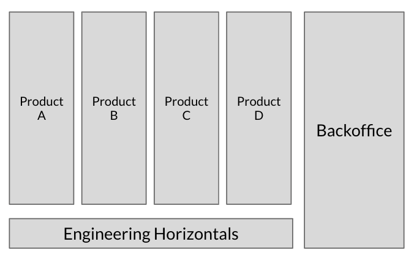

### The CTO Field Guide (for the first 90 days)

That's a big title and huge post. I've written many pieces of it through the last years and decided to put them all together. I mostly write to myself but hopes that it helps someone. 
I wanted to get your attention. When I put CTO there, I meant a tech lead, engineering manager, director of engineering, VP of Engineering in any sized organisation —  anyone that is joining a new company and figuring out where to start. And why 90 days ? It seems a good time measure. Honestly you won't have the time.

Not only that — I also want to reach the group of people that got promoted (a long waited promotion or the "you, yes you. step in as engineering manager" kind of promotion).

I've been helping startup CTOs and other tech leads as a mentor for 6 years, mostly learning with them and helping where I can. I took notes. A lot of them. I also keep diaries about my own professional experiences that I review from time to time.

### Table of contents

  * [Introduction](#introduction)    
  * [The plan](#the-plan)    
  * [Learning and Measuring](#learning-and-measuring)
  * [Challenges](#challenges)
  * [Org structure](#org-structure)
  * [Delivery](#delivery)
  * [Closing advices](#closing-advices)
            

#### Introduction
I've learned a lot about myself writing down diaries for each company I worked for. We are used to looking only for stellar success or big failures but there is a lot in between. I wrote about my [career change](https://medium.com/@gleicon/move-fast-and-intentionally-ignore-a-couple-of-things-8731727ad845) if you are interested.

What struck me most is how starting is hard. There are so many variables that it is unfair to think you will be able to cover most of them. And when you start, you are in a hurry to show some service, to help and succeed, which mounts up the pressure.

So I put together what I consider a fair sequence to learn and act as a guide for tech leadership. As it is based on my observations and experience, it is an opinionated guide. It is heavily based on my perspective and beliefs through these experiences. 

Before anything else, we will start with THE PLAN.

#### The plan

Before starting the new gig, even if the only time you have is the weekend before starting your new position, put a plan together. It doesn't need to be complex but it has to have a path to start, which you can go back after a full day and recognise. 

You probably don't need or will follow all items in there but it is a good baseline to learn how you evolved later on. It is good to look back and see how naive or to the point you were planning your new endeavour. 

I created a slide deck to help organise the plan. It has high level questions based on items I describe in this post. The order is flexible too. It is a template and a guideline you can expand for your due diligence. You can [find it here](https://docs.google.com/presentation/d/1KCh-gzfWYL-EcBQBS19ESPHwsfnubr7m8hKaXshH8Hw/edit?usp=sharing). 

Ideally you will make notes after each section or subsection to revisit later or measure. The plan is to learn. There are advices throughout the text that you may or may not follow but use it to set up your baseline. The order is sugggested based on information you need to learn for each step.

#### Learning and Measuring

So, how do you say something is good or bad ? How do you demonstrate things that are obvious to you but not so obvious to the person or group you are talking to ? Apart from telepathy you can use known baselines and metrics from companies that you can relate and derive them. After some time repeating "we did that in company X or Y" gets tired as you are not there anymore, your team does not works there. So having a simple deriving path help other people learn what you know, which is the first step to influence them.

I've grouped what concerns me when I want to make an assessment in four sections. For each one of the sections I've put together baseline metrics or concepts. Some are obvious as smarter people came before us and studied them, some of them require some imagination. 

##### Engineering Delivery Metrics

The first four metrics I've borrowed from the Accelerate book. If you have not read it, you should. It is a book based on research and as good research you will find a good taxonomy and baseline. [Accelerate | by Nicole Forsgren, Jez Humble & Gene Kim](https://itrevolution.com/book/accelerate/).

The rational is: with the tools we have today, deploying should not be a problem and by deploying often we are able to fix what hurts us in the process. With that in mind we can look how a range of organisations are behaving, abstracting their internal decision path and focusing on metrics that are common across them. 

There is a world of issues and problems in the way, ranging from quality to compliance but the idea is to iterate over this process to achieve a high rate of deployment with a low lead time and time to recover while measuring how failure happens. So this are the first four metrics to look for. They are there, somewhere in your organisation.

	* Deployment Frequency
	* Lead time for changes
	* MTTR (Mean Time To Recover)
	* Change Rate Failure

I've added a metric of empathy to the folks that get the first call at your company, the invisible mob of customer experience and support teams:

	* Incidents count per week

This is an important reality check on resourcing and prioritising within teams, and often overlooked as "Stakeholder managemente issues". A lot of shadow work by your team is done to mitigate or compensate for this. Looking at change failure rate prevents its increase but having a strong foothold on incidents helps understand if all that you are doing is everything that should be done. 

If you hear that your organisation was "Sales Oriented" it becomes important as a way to gauge side effects of technical debt. A "sales request to feature" flow is no different than the "product feature request to code" flow if you don't take in account how your systems break and in which way they affect your customer life. 

I've also added some metrics for my friends at the CFO office, under the umbrella of Cloud Economics: 

	* Monthly/yearly cloud expenses total and per product line
	* Licenses costs
	* Support cost 
	* Ammount of discounts due to enterprise deals and negotiations

"We are just burning money, no worries about it, we're a startup" or "We are spending on cloud to save engineering time" concepts are amazingly misplaced and naive. Money only buys velocity if you are buying a racing car. Money buys tools to build things and money doesn't likes to be thrown around. You may get a free pass for a while spending and not knowing where the truth lies these truisms will hurt. That pass won't last forever. 

Strive to know how much you spend, where are the low hanging fruit and how to feedback to business and the team how much they are spending. Engineers love a challenge and they like to see how well their code is performing. Cost of goods sold (a way of pricing what you sell) should include this. If no one asked you about it, be the first one to inform everyone and keep a tag on it. 

I've lost count of times spent having to work overtime to reduce unexpected cloud billing or fix a big money leak found too late. Also lost sight of how much I worked double time to build yearly budgets in the last minute when someone high up learned this is the company's 2nd or 3rd biggest expense. Having a way to see it quickly and to see a pattern helps on both.

##### Team Metrics

Here the term "metrics" is loose: look for and quantify how the team is working now, without prejudice or trying to change it. Map it well to try to find why it is like this, and what is the measure of success of each decision.

###### How does the current organisation work ?

You will face a number of terms that may be familiar but are used with different meanings within the company. Teams, squads, tribes, chapters, guilds, teams (again for the sake of sanity), business units, great areas etc. Learn them, connect with the language. Build a glossary. 

###### How many unhealthy teams: no manager, stretched managers, no product manager

It is important to map where people don't want to work (the haunted teams), where are the heroes, where the real work happens and the territories. Yes territories, you may question why Team A has 30 people, all looking fresh and nice and why Team B have 2 disgruntled engineers. Learn this, it may be the reason you were brought in. By stretched managers I mean teams that should be split of managers accumulating teams.

###### Work distribution issues: work that should be done elsewhere, duplicated work, prioritisation

The side-effect of siloed organisations (teams, tribes, squads) is that one way out of an argument is to duplicate work. This may be a strength or as most of the times, waste of energy. Look for work done within a tech team and/or by a product manager that should be automated or executed elsewhere. Mark it. Also look how prioritisation and escalation works. 

Who or which group call the shots ? How people know what to do. Look closely for slack channels that are used as "help" or "listening" channels with dynamics of people trying to get attention. Attend as many prioritisation and planning ritual as you can to gather field experience. 

Try to understand if escalations are done through "old friends" or is methodical. By escalations I mean any decision that could not be decided by peers or stakeholders and go up the chain to the CEO or other executive. If escalations is how most of things are decided and can undermine the belief on any prioritisation process.

###### What is the priority definition between engineering and products ?

Is there a set of rules for deciding what to do ? Are there teams that feel "priority changes every time"? Have you heard "I am no people manager, just X manager" ? Is there a good positive tension between engineering and product people to decide what to do ? Does product work sounds like project management and engineering as body shop ? Take a note, you may need to figure out a standard prioritisation process for everyone. A good team is a team where everyone has a voice. 

###### What is the decision making process (RFC, committee, go horse)? 

Look for documents as PRD (Product Requirements Document), RFC (request for comment), definitions on PR review (pull request review). Is there a decision group in place ? How have the team decided to migrate from databases or cloud providers ? Was it generalised as "top down" ? It is healthy for an engineering team to create a way to discuss and document their decisions. It is good for training and onboarding. 

Look for postmortems. It is good to remember why we never use web scale databases anymore or obscure niche tech. Don't fall into the trap of confusing autonomy with chaos of lost decision track, writing is good.

Figure it out if there is a small group of people that make these calls — all engineers should do it. Architecture groups and boards are a thing of the past, no smart engineer wants to work against a spec sheet. Use their seniority to train and gather consensus on why it is better to stick to 2 or 3 stacks than 200 semi-functional languages that only few people heard about. Help people improve their arguments and document them.

###### Are there clear levelling for ICs(Individual contributors) and Managers ?

First order of the day: how do you evaluate, give feedback and help your team to grow ? Look for you company's career ladder, if you find none — it is one of the things you need to kickstart right away. You can get inspired at engineering ladders and levels.fyi. I've built an engineering/manager ladder based on what I've been using. 

[An Engineering Ladder Example](https://drive.google.com/file/d/1vSe3gr-gLainl8cLhFLsGVY4odE9GrA6/view?usp=sharing) 

Look for performance reviews and any document for your direct reports. No performance cycle process ? That's a consequence of a good ladder and there are tools to help automate it. You can do it straight on spreadsheets if needed.

No team will be healthy without knowing where they and, where they will go and without candid feedback about their performance and growth. Also remember there is no Y career — you need both careers (management and engineering) and a good write up on how the pendulum works there. Look at [Engineering Ladders](http://www.engineeringladders.com/) for existing ladders and [Levels.fyi](https://levels.fyi) for how they compare across companies.

##### HR and Engineering Organisation insights

The questions below are to give you an insight of how HR interacts with the engineering team. There are companies where both teams seem to be at war and others where they work well. There is information that you will only learn in a neutral way by collaborating with your HR partner. 
Most of what you will have to work with people in your team you can only solve with them, for expertise and safety sake. You will find plenty of corporate disasters that could be avoided just by looping someone more experienced from HR to help or lead a conversation.

###### How is hiring organised ? Is everyone helping ? What are the goals ?

Hiring is everyone's job and highest priority. No "I can't interview because I'm putting out these fires" or "I can't talk to you because you are always on interviews". A lot of problems in engineering are due to poorly staffed teams. Work on it. If you don't know where to start, use my template:

[Engineering Interview Templates](https://docs.google.com/spreadsheets/d/1K_KRvM6Iq5DPL_URtQrGx43Sd5PTZE40po29WMlyOuc/edit?usp=sharing)

Make it so at least 3 people interview a candidate, one of them someone with good people skills (HR partner). Gather everyone together, compare notes and make a call based on how you all read the candidate. Ask the hard questions beyond "cultural fit". You don't want someone tame or aggressive, friend or public figure - you want the best for the team.

It is easy once you start organising a basic interview guideline and a process where you ensure no biases are applied — it can use a daily or weekly committee to quickly assess the notes you took while interviewing. You take notes when you interview someone, right ? 

###### Are there hidden functions ? (Infosec done by a SRE, prioritisation done by committees) ?

Understaffed teams have a reason: no headcount, no leadership, reorgs, acquisitions, bad leadership. You have to learn about them and the whys. Prioritisation done by committees appear here because that's the tool of micromanagers. Decisions require owners, the best teams own their decisions. The mediocre ones wait on external guidelines and quality of work suffer. You want to know about that. 

###### Any functions/procedures depend on a single individual ? (e.g. the person that knows legacy code or how to deploy, or point of contact to solve an issue)

No heroes, no bus factor should be allowed for the sake of people's mental health. If you have them, HR can tell you the reason: new engineers only go for the nice frontend project, product is being discontinued, no one can put up to work with this or that person and so on. Something is up and you wanna know upfront.

###### Any team missing ? Infosec, SRE or Platform infrastructure, Engineering tools, Data engineering, Data Science, Product Engineering, Digital channels, Notifications teams ? The big rewrite team ? The team that should manage the legacy while the rewrite team is doing their thing ?

Staffing decisions again, you need context and history. Managers tend to leave a trail of destruction behind when they are under pressure and decide to leave. If you are joining a company or team because of that, look further.

###### Is remote work allowed ? Is it successful ?

How do you do it, how do you measure it. Tip: if remote work doesn't work for you, look up the chain of command. A good manager is required for remote team to be successful — good in the sense of communicating well, planning ahead and knowing how to organise team rituals.

##### Operations

I'll use "Operations" as a generic fallback for day to day stuff that I have not covered above or covered only the metrics. These are questions you ask your peers outside of your team, your boss and if you have the chance, the person you are filling in for. 

##### Is there an incident process ?

How do you know an incident from a bug ? Who listens first ? The CEO complaining in a public channel on Slack ? A loud person in the office crashing the coffee room looking for a senior engineer ? How does it help people now being interrupted unless something is really important ? How comfortable people outside of tech feel about its precision ?

##### Is there an incident severity matrix, blameless postmortems and product feedback ?
Same as above: what is important, what is not ? At e-commerces companies, the purchase flow is king. Payment is important for most companies, conversion metrics, availability of the main website, server provisioning. 

When something is down or broken and the team fixes it, how do they learn about it ? How do they make sure they will have time to fix it instead of implementing a new feature ?

##### How is productivity measured ? Any product vs engineering stale-matches ?

"I wish I could do it but I am a product manager, not the team manager" or "it is done when is done, engineering is hard" are not good things to say. They make a team look along making the person saying it be perceived as unreliable. Team productivity using points, marshmallows or any gateway metric sucks and doesn't increase people's awareness of productivity. How is your team(s) productivity perceived and measured ?

##### How are growth incentives aligned for maintenance and green field work ?

Let me take this out of the way first: If you have an OKR or equivalent to measure closed bugs, kill it. Same for yearly bonuses triggered by some flat metric as "closed JIRA tickets". They set the wrong incentives, working on bugs, legacy code, improving quality is everyone's work. 

Public kudos and prizes have to be carefully put in place: which behaviour you want to foster ? How is this connected to growth expectations ? This is seen by the whole team and can create conditioning that working on bugs is less important for your career growth than working on new features. 

How does the company deals with a misplaced incentive as someone focusing on what helps win a prize and leaving work behind ? It is common to find companies where employees with misaligned prizes (lunches, stars, days offs) are fired or leave. 

It is important for you to understand how the team is conditioned. These incentives have to be aligned with the prioritisation process that helps everyone. 

#### Challenges

Joining an existing team is hard, especially if it is during or after a reorganisation. Reorganisations, or reorgs, are just a tool. Sometimes they are seen as punitive or meaningless but they are just a way of trying to tame the uncertainty of how a team should organise to achieve its objective. 

Common questions are "Where will rejection come from ?", "What failure looks like ?", "Where are the leverages ?" and "When will the next reorg happen?"

##### How they will react to a new structure or a new high level executive ?
One of the weirdest experiences you can have is to be hired and not have a defined team or role. This is when an executive is crying for help, hires a senior executive but forgets that if he can't deal with what is happening now, probably a new executive will fail. 

It comes as a surprise to most CTOs and higher ups that the team is not "with them" all the time and are struggling for power — the one he delegated to a new comer. 
This is why gathering knowledge comes before defining strategies to meet challenges. Once you have clear data and objectives, personal reactions are just that: personal reactions. 

##### What “Lead by example” means in the company’s context ?

Leading by example varies in intensity and subject. What does not work is to hire managers that don't know what the team does. "I take care of humans and I have someone to take care of technology" and "I deal with the boring business and HR stuff while you get your fingers dirt coding" are not smart things to say. Fortunately these managers are going away and you are stepping in. 

Look out for starting small and simple, pair up with engineers. Set up your workstation and strive to push code out, a bug fix. Fail at that, but try to feel what your team feels when they are getting things done. Be part of rituals, planning and discussion. Tie break and top down, deal with the push back and strike new dialog venues. 

##### Which public forums the team have ? How can they be heard ? (all hands, town halls, teams gathering)

There are always grapevines. People will be talking about you, about what you do and so on. But you need official channels, clear communication and transparency. Over time they get stronger and people start looking up for them. Don't try to shut down channels, build better and interesting ones.

Transparency is not abuse. On public forums, anonymous questions are good but for the sake of the team they should be respectful and naturally curious. Look up for the signal/noise ratio among hard questions. Take them upfront. If you feel you are not good enough to answer them, take a note, put them in a doc, answer later on and publish for everyone's consumption. Leave no question asked but repeated, silly and purposefully aggressive. 

##### Unclear dotted lines: teams that have no clear boundaries.

By influence or legacy a team can have many influence flows. First hires, the CTO-turned-engineer, the new director of engineering that worked there long before, the CTO that was fired, the product manager that migrated from engineering are some. 

These are noisy but no noisier than having teams with split management: sales integration, marketing technology, operational squads. Look for having a clear objective and reporting line within your team. If this is not possible, they should not be there. At the end of the day, accountability is hard to be split across managers.

#### Org Structure

Every company you go nowadays you see a variation of the "Spotify Model". I won't even link because there are many posts around and I'm not sure even Spotify uses it anymore. The thing is that as it happened with Scrum, it layered roles and organisations over existing positions and teams.

Among the many permutations that create the illusion of control you will find yourself looking for the abstractions and controls that connect with your experience. 

Looking to the average implementation of this model:

##### Multidisciplinary tribes, layered teams 

Each and every team/squad/tribe requires individuals of all chapters (disciplines): product, engineering, data, ops, finance. This started the trend of solid and dotted lines based on the concept that to make things easier and practical everyone should work closely. Solid lines are who manages you, dotted who manages your work. 

This also creates some confusion and loosening accountability up until the general manager/tribe lead. All groups want a saying and should they balance their solid/dotted line hierarchy to do that ? Or the tribe lead ?

Abstract all that and connect to your abstraction of choice. Follow the money: once you know productivity and prioritisation flows plus the metrics that ensure a healthy engineering org, how do you influence it ? If it all goes away, how would you reorganise your team ? How you deal with conflicts across "tribes" ?

###### Pros: one stop shop for business verticals, quick reaction time to day to day business needs

Emulating a small company you can move fast and absorb local optimisation and debts. If the business changes a lot you end up having a lot of agility to tend these changes. 

###### Cons: amplify the cost of simple decisions, as business grows it requires more high level arbitration

Matrix reports and their decision are a thing — a head of product for the company may not be happy if they can't do portfolio management. A CTO may not be happy if they can't do tech visions and engineering. A lot of intra tribe decisions trickle out to the origin organisations. 

Cross tribe work is always painful. A local priority always takes over a distributed priority — "Hurr the CEO is the tribe master and can fix it etc" — remember what real tribes did in the past when they met: Killed each other, conquered territories based on not knowing each other language. Be mindful of names and behaviours. 

##### Can’t prioritise and execute cross business or engineering tasks

Shared efforts are hard to push. Some decisions coming from Legal, Finance and Infrastructure have goals and directions that can not always be consensus driven as costs management, undifferentiated lifting, standardisation, compliance and due diligences. These are usually overseen and done in a hurry if it hurts the business.

##### Legacy product and code management is hard

Organisations that were not born this way (most if not all of them) may have shared codebase and processes. Who owns them prior to a big micro service split and rewrite ? Look up for teams called "ACME", "ATLAS", "PHOENIX" or "SKUNKWORKS" that "takes care of what no one is looking for"

Vertical Tribes over a thin engineering horizontal and a catch all back office team

The tribe model is too stretched, as we discussed cross business concerns are spread across individuals, it is hard to identify duplicated decisions and structures: If I don’t like your mobile framework, should I adopt a new one ? The cost of discussing it through the CTO may make deciding locally attractive. 

A balanced approach for fast product teams taking in account the engineering and business undifferentiated lifting

After these stretches most organisations approach the independence problem from a Business Area with shared P&L (profit and loss) perspective, looking where sharing can optimise cost and speed. All that to say we always revert to the same model.

	* Keep tribes where it make sense
	* Invest on platforms, bottom heavy, light on product/customer interfaces
	* Identify shared efforts
	* Speak product language even for internal customers
	* Shared P&L

Specifically for engineering organisations, nimbler product teams foster a strong dependency on APIs — you can't possibly predict permutations done at the edge of the product so sticking to strong APIs is a proven strategy.

Authentication, API management, InfoSec, Notification service, Digital channels management, Design, Cloud Economics, Developer tooling, Analytics and Data Engineering are naturally shared and costly to replicate locally. 

These efforts benefit teams outside of technology or tribes and they are benefited from a solid strategy and operational efficiency. Undifferentiated lifting should be done once and for all.

#### Delivery
I've mentioned the Accelerate book before and it provides a good framework to evaluate delivery. When I say delivery I mean the mix of running your systems and all activities connected to it, including building and shipping code and how it affects your customers. 

Back in the day everything was slow and manual but after the wide adoption of cloud providers and disciplines as Devops, SRE and Production Engineering the effort of engineers in these teams are set to simplify operations through automation. 

###### Operate based on metrics

Adopt an observability tool and go beyond CPU/Disk/Latency metrics. Collect meaningful business metrics and operate from them. They should guide your decision as each platform presents multiple base metrics but few are not about something redundant (servers, disks, network).

###### Invest on tooling for automation, deployment and metrics collection

A code template tool, abstraction to make engineering work secure and repeatable, automated deployment and monitoring are expensive but once built they take operations to a new level. They get heavy lifting out of the way.

###### Enable accessible CD through GitOps

Deploys should not be rituals. You need a way to track them but they should be done multiple times a day in a way that you can assess if prioritisation, complexity or lack of purpose is the problem. Not access, arcane knowledge or risky environments. Having them integrated on how you build code is key. When code is merged, it goes to production. No special control panels. 

Look for at least 70% of infra/deploys to be uniform, leave corner cases for data and mobile. Invest on short feature deployment cycles with product prioritisation (lower lead time). Implement "You build You Run" in an standard way
Simplify your stack — good engineering is boring. Avoid virtue signalling when building blocks: functional language, NoSQL databases, niche architectures are all nicer when they come naturally. 

##### Cost Management

Investments in good infrastructure engineering yield good cost management. 

It all starts when you Tag and control Cloud resources. No VM or disk should be up without information about team, product and owner. With that you can tag which products use the most, as the cloud dashboards are not that good on knowing how your platform is structured. 

The next step is to conduct monthly resource distribution reviews. It means simply looking at how your money is distributed, low hanging fruits and new things happening in production. The least surprise principle applies.  

These two items seems to be naive and easy but I strongly advice you start doing them right away, manually.

After a cycle of doing it manually, adopt at least one cloud cost management tool besides the one the cloud vendor provides. Besides usability you want neutrality. Tools that before being clear on what you are expending want to tell you how to save the money have mixed incentives. There are free and paid tools depending on your provider. They usually implement schedulers to park (turn off or stop) test, development and other unused resources at night and weekends if you are not using them.

Some cloud providers give you increasing discounts as your usage grows. Others rely on reservation, saving plans and ephemeral instances. Prepare for yearly planning to do a reservation (or the equivalent) cycle and monitor its usage. You don't want to commit and don't use it and it is easy to let it slip as capacity planning is hard. Opt for flexible commitments that let you convert credits among resources.

Only go for containers with a stable stack and after nailing CI/CD. Containers are great for density and usage, but nothing wrong with Virtual Machines if they fit your bill. Autoscaling suffers outside of Kubernetes but there are other benefits. 

Speaking of which, when you go for specialised tools such as Kubernetes, you also have to go for specialised people and remember that distributed systems are hard. Pick your fight. The stable stack I've mentioned is the one that fits well your development model and containers. Don't stuff a huge application into a thing designed to grow horizontally. 2TB containers don't make sense.

Monitor egress and ingress traffic, cross region and hidden Cloud costs. For instance at the [Open AWS GUIDE](https://github.com/open-guides/og-aws) you will find a session about [network costs](https://github.com/open-guides/og-aws#aws-data-transfer-costs). The figures are not up to date but the flow is clear. 

I've seen huge bills due to non mapped traffic through Managed NAT Gateways and poorly set S3 buckets. Same for EKS you can hurt yourself with cross zone traffic. Loose disk snapshots and images, unused load balancers and gateways are a source of hidden cost. Keep an eye on them, tidy up.

##### Visibility and Observability

I've mentioned adopting observability, the "You build, You Run" model but the last part missing is to drive incident management processes, automation to protect delivery. We have a tendency to slow down when quality suffers. But quality is subjective. 

It is easy to default to creating bureaucratic structures when it is hard to measure or understand what is happening. I suggest that if you don't have some sort of visibility yet, start doing the following: 

	* Publish weekly metrics reports, for everyone, start with the ones we discussed here.
	* Organise monthly postmortems and learning events
	* Get involved in incidents, be there, help coordinate, just watch, help write postmortems. Lead by example, and in this context the example is simple.
	* Distribute the metric and measurement efforts to all teams, with reports published weekly by them. Start your big meetings with hand picked metrics review. The good and bad ones. Work on the bad ones, rinse and repeat.

##### Infosec

Being on the losing end of a leak or security incident hurts. You are not alone. It is not if, it is when. Working with security has a double burden: it is always critical and you have to deal with the worst kind of initiative all around. Be mindful of your mental health all the times.

As a CTO or tech executive you may have to manage an Infosec team. Or step into one. Or deal with one of these teams out of your organisation. I will hereby thread safely and respectfully giving the advice that helped me in such times. 

The advice that helped me most is to hire people that really like Infosec, curious engineers that are willing to learn what they don't know. This is slightly different than seasoned or traditional Infosec engineers. Hire experienced security engineers to teach them and your team. 

Strike a good balance there and you will be surprised, especially in the offensive security world. Software engineers learn fast and like to be challenged. 

Get involved in communities as B-Sides, events as H2HC and so on. 

Learn. Read a lot. I suggest this comprehensive Cloud Security guide:

[The Extended AWS Security Ramp-Up Guide](https://research.nccgroup.com/2020/04/24/the-extended-aws-security-ramp-up-guide/amp/) 

I am saying all that because some may point that Infosec is for Infosec folks. But at tech startups the role is not clear. Sometimes it is derived from engineering, platform or infrastructure teams. Most of the time is a part time job until an incident happen. 

This is positive as it brings folks to Infosec that wouldn't switch careers if not given the opportunity. 
Look where no one is looking. Make it easy for engineers to secure their apps and services as they do with testing. Trust no one, especially yourself and WebView mobile apps. Invest on hiring offensive engineers, or software engineers that like to break stuff. It pays off, a lot. 

Read and learn about [threat matrix](https://attack.mitre.org/), create a simple one and grow them. If your company is too small, look at the Infosec community for a consultant outside of big consulting companies. 

Avoid at all costs an Infosec org that works as a barrier for people doing what they need to do. Train them to help you. This is important. The work is complex and you will deal with complex situations most of the time. 

When you say no, people will try to negotiate around it and this will add to your frustration. This is not a side job. Break that cycle, separate what is business and compliance from the core Infosec mission of protecting the business. They work on different speeds. 

For tooling — same advice as infrastructure: go for automation, find good [pentesting](https://en.wikipedia.org/wiki/Penetration_test) and code review tools that plug on git and help you to improve development. Everything starts there, when you are in a rush you make bad choices.

Look for compliance advice that reflects on engineering decisions early: PII (private identifiable data) storage can change depending where you are, what you do which info you collect. Money spent here is money well spent. 

Tie this with the work of your Data and Analytics team, write a data policy and data matrix that tells you the minimal requirements for GDPR (Europe), LGPD (Brazil), CCPA and other regulations around the world. Keep a strong track of data ancestry (where the data came from).

Read security incidents postmortems. Start by the [Capital One Data Breach](https://krebsonsecurity.com/2019/08/what-we-can-learn-from-the-capital-one-hack/). You can find them everywhere, look for your organisation story and build them if they don’t exist. 

If you don't have Infosec Metrics, start with two metrics: 

	* Incidents per month 
	* Time to fix vulnerabilities found by pen testing. 

These are relevant to engineers, product managers and people outside of your organisation. At some point, interrupting the team to fix security findings will appear in the top 5 reasons why a new feature was not delivered and it is good to have history.

##### Data

You will probably manage a variety of Data teams combinations. Sometimes they will be close together, sometimes they will be far apart. It is important to note that companies will sometimes start something outside of the product/engineering team to do data science as an accelerator or valuation booster, not necessarily as part of the product. 

It is also worth noting that Data means money spent on infrastructure and growing security and compliance risks. It comes to no help that good data infrastructure will step in when the product lacks features, sometimes not in the best way (bunch of python scripts, shadow IT holding PII data, endless support requests when a data source is broken or changed).

Data is valuable and deserves a few comments. There are some common teams that deal with Data:

*Data Engineering*: Sometimes data infra, but builds platform and data lakes, model data, automate ETLs and ingestions. You will see these teams migrating to support machine learning pipelines and large analytics efforts.

*Analytics or BI*: Coming from a corporate set and adapting, these are people that can figure out what the data means, build churn and regression models, support high executives on complex decisions by forecasting market or sales. A lot of data scientists sit there or start there to move on to specialised roles.

*Data Science*: People of all backgrounds are set to solve hard problems by using data. If you find a better description please let me know, I saw it a lot and all of them are different. 

The foundation of a good Data Engineer is a good Engineer. The specialisation is on tools and methodologies but overall you should look for good principles. Data Scientists without a good engineering foundation struggle to deliver. Analytics/BI without engineering usually does very well. Go figure.

Data engineering is not Devops. There is a migration of Infrastructure Engineers to Data due to affinity of platform and infrastructure but their mindset is different. Managing distributed databases, migrating data, draining and running queues may look as an infrastructure problem but it requires a different set of tools and knowledge.

This advice saved my life more times than I could count: “80% of a data scientist work is data engineering (data preparation and tooling) — Fabiane Nardon”

I live by this quote. Every company I worked for had a struggle between teams that was only solved when the engineering behind the work was understood and solved. 

My advice for tech leads and engineering managers in Data Teams: 
	
	* Make people work together, avoid silos. 
	* Understand the engineering required to run complex data work but abstract the day to day analytics. 
	* Spend time and share objectives with your Infosec and Compliance teams, you will be looped into that anyway for a certification or notification.
	* Create discipline to pick your tooling and avoid big migrations (anything over 10TB is hard to migrate timely in the cloud)
	* Push work to the teams: analytics, data science, machine learning should be close to product, it doesn't work in a project office fashion. Look for Airbnb, Uber and Pinterest benchmarks. Break silos early on. Provide orthogonal structure and support tho. 
	* Work on model deployment (for machine learning models) early on.
	* Be flexible on how you archive data. Migrating data is a pain in the cloud, duplicate it if needed (one archive sorted by date, same data sorted by user ID)

Avoid: 

	* Too many of each building block (e.g. standardise databases and caches as much as possible)
	* Non partitioned databases
	* Unmanaged mix between events/serverless and batch processing
	* Building a scheduler (use Apache Airflow)
	* Building a log pipeline (use ELK, use Athena/S3)
	* Teams too far apart or disconnected

#### Closing advices

Is this a book ? Not yet. Not the authoritative source for what you should do. I've put down what helped me and not when it helped me, because I tried to abstract situations, companies and people.

When building or reorganising teams, keep the span of control on 5 to 8 people for each manager, including you. Opt for line managers with small teams and clear objective and planning rituals that you can help instead of an overly hierarchical org. Engineering managers should support line managers, this is their most important job (a close) second only to hiring. 

Advocate for standard stacks and technology. Not the one you love, but the ones that work well for the team. Make them accountable for delivery. 

Run a Manager Training session. It can be simple as a book reading club. I suggest you base it on the book [“An Elegant Puzzle”](https://lethain.com/elegant-puzzle/). Conduct role playing sessions to learn how to give and receive feedback.

Remember that what brought you here is not guaranteed to work in the future. Learn how the new generations work, there is a lot to learn with them. Drop the "blame the millennials" bullshit. Don't make them suffer what you did just because, don't be petty. 

People are important, technology is a side-effect, Money can’t buy everything but helps a lot. Good and smart engineering helps more. Don’t try to blindly save on tools that help your team.

And finally, you are the outsider, people tend to think the past was better than it really was. They will probably blame you for the change at some point. Breathe, give some space. But be kind to yourself and straight clear when people step over your boundaries. 

Have fun !

